Navigating the WashU Virus Genome Browser
=========================================

Virus Browser Home Page
-----------------------

The WashU Virus Genome Browser hosts hundreds to thousands of genomic sequence pairwise alignments to the reference for 4 virus species: SARS-CoV-2, severe acute respiratory syndrome coronavirus (SARS-CoV), Middle East respiratory syndrome coronavirus (MERS-CoV), and Ebola. When users first navigate to the browser landing page (http://virusgateway.wustl.edu/), they are provided with a drop-down menu of the 4 hosted viruses (red arrow below), to select which virus they would like to view as their reference.

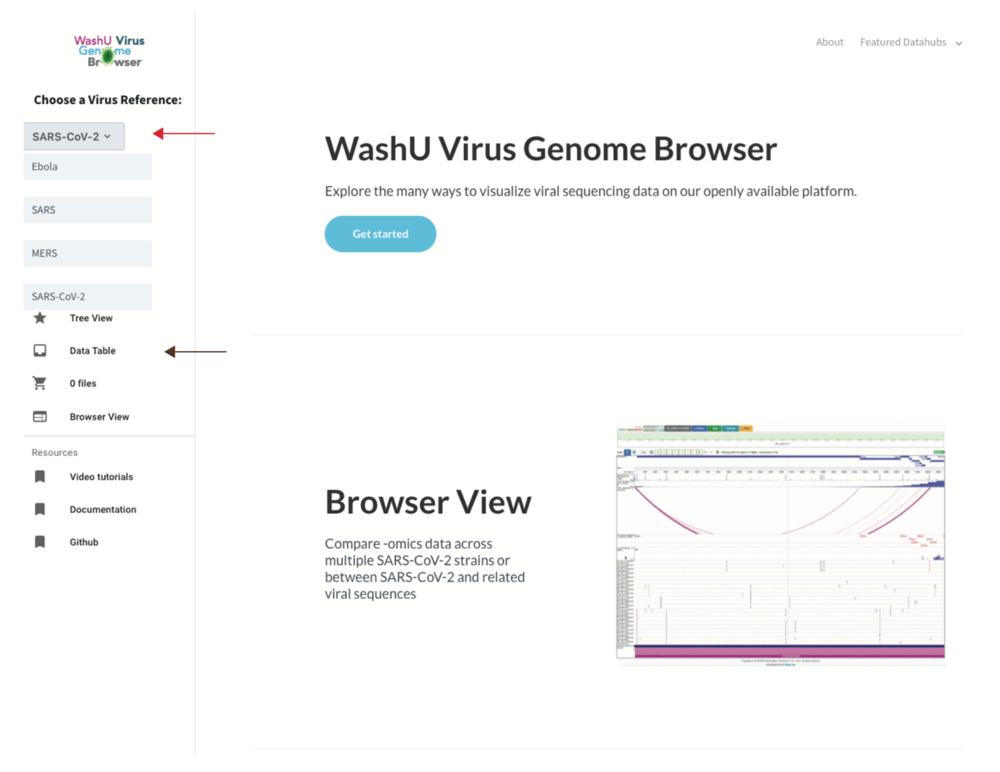

Upon selecting a reference species and clicking “Data Table” (brown arrow above), the user is then taken to a table populated with sortable and searchable metadata for all  available strains of the species. The user can then select strains of interest (examples are highlighted in purple below), and continue to view those particular strains in either our genomic track browser view or see how their selected strains relate to all other available strains of the species in our phylogenetic tree view. Please note that for SARS-CoV-2, only strains housed in Nextstrain (PMID:29790939) are displayed in the data table as well as in the tree view.

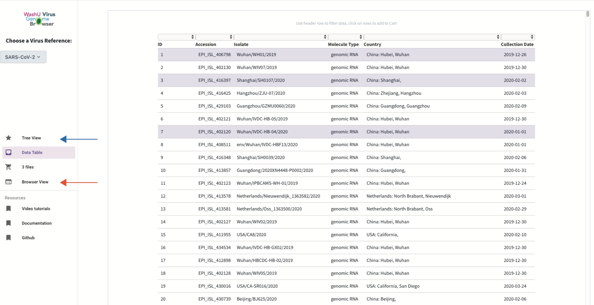

Genomic Track View
-----------------------

When users select the “Browser View” (orange arrow above), they are taken to our standard browser view layout, adapted from the WashU Epigenome Browser (https://epigenomegateway.wustl.edu/). The WashU Virus Genome Browser maintains the functionality of the Epigenome Browser while also incorporating new features particularly useful for probing virus genomics data.

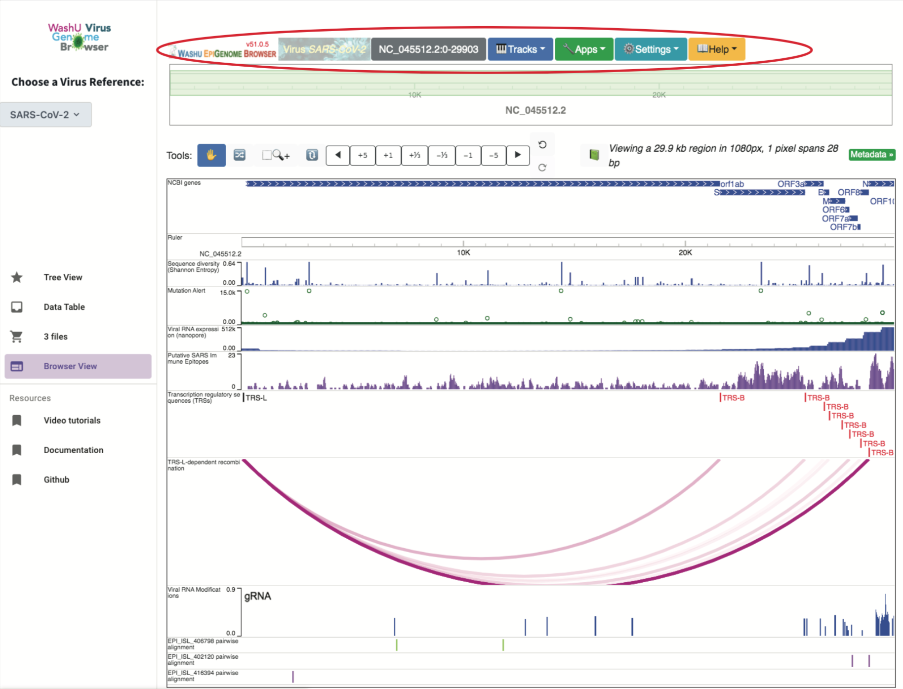

To the right of the WashU Virus Genome Browser logo is a utility bar (circled above in red), similar to the one provided in the WashU Epigenome Browser. From left to right, this bar lists the reference species the user is currently viewing, provides a platform for navigating the genome to particular regions of interest, provides a drop-down menu for selecting data tracks to be viewed on the browser, provides several applications for viewing, sharing, or saving region views and tracks of interest, and provides several customizable options in “Settings”, such as the ability to highlight a region of interest and change the track length width, among others. Detailed information regarding the use of the region locator can be found within the Epigenome Browser tutorial (https://readthedocs.io/en/latest/usage.html#the-top-menu).

Details regarding the default tracks loaded into view for SARS-CoV-2, which include a sequence diversity track, a mutation frequency track, RNA expression, putative SARS immune epitopes, transcription regulatory sequence locations, recombinations, RNA modifications, and SNV tracks of any strains in the user’s cart, are discussed further below.

Tracks
^^^^^^

The “Tracks” tab lists several functionalities, from loading existing tracks hosted by the browser to user-specified uploads.

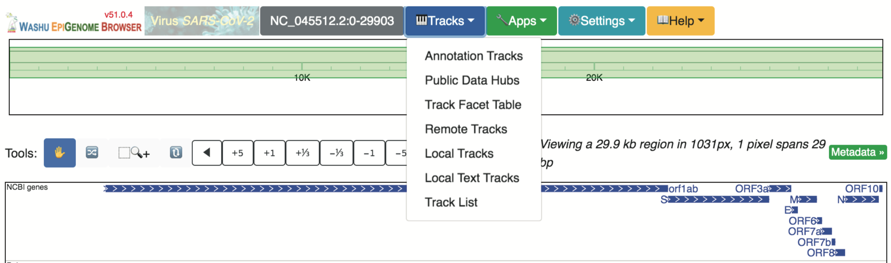

From this drop-down menu, if the user selects “Annotation Tracks:, an expandable menu of pre-existing tracks appears for the user to select from. For SARS-CoV-2, these tracks include gene annotations, genome comparison tracks, a GC density track, as well as a sequence diversity track and a mutation alert track, all of which can be loaded into the current browser session. Of particular clinical importance, the Sequence diversity (Shannon Entropy) track comprehensively displays the divergence across all GISAID strains at each genomic position. Additionally, the “Mutation Alter” track displays the number of strains with a mutation at each position. Together, these tracks provide an overview of accumulating mutations and their abundance, aiding in monitoring diagnostic primers for expected effectiveness as the virus evolves. Because of this utility, both the “Sequence diversity (Shannon Entropy)” track and the “Mutation Alert” track are loaded into view by default.

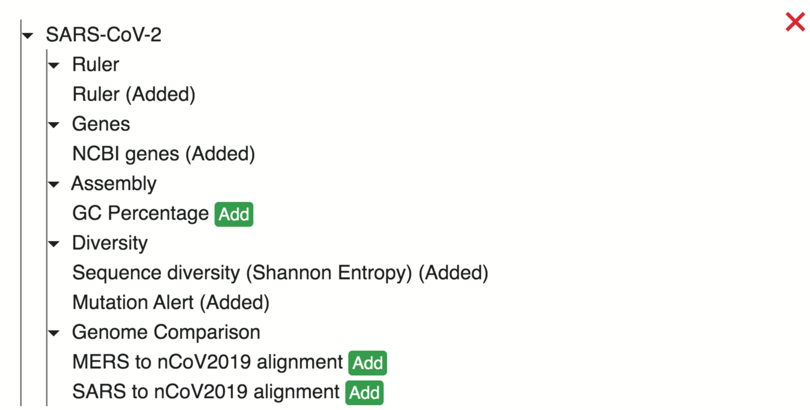

The “Remote Tracks” selections allow for user-upload of individual tracks or data hubs from a hosted url. Upon selection, the user is prompted to select whether he/she would like to upload an individual track (default tab) or upload a data hub (right-hand tab). The user can then select the drop-down arrow under “Track type” to view all tracks supported by the WashU Virus Browser and select the track type matching their data. 

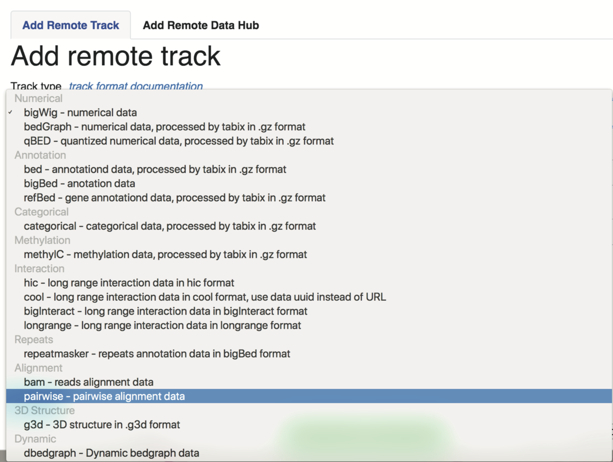

A comprehensive list and description of these tracks can be found here: https://eg.readthedocs.io.en/latest/tracks.html.

To upload a track (in text format, such as a .bed.txt, .bedgraph.txt, or .longrange.txt, etc.) directly from one’s compute, the user would select “Local Text Tracks”. Upon selection, the user can select from the drop-down menu the file type that matches their data. In the default view of this pop-up window, the text file format is “bed” and an example of the text file format is below. Optionally, the user can configure track options, such as metadata, track height, track color, etc. by filling in the text box below.

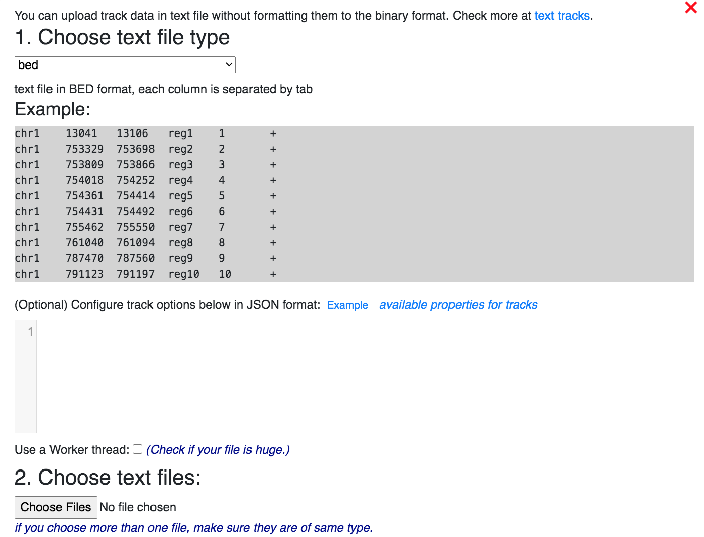

To upload a track (in binary format, such as .bigwig, .hic, .g3d, .bedgraoh.gz(.tbi), .bed.gz, ect.) directly from one’s computer, the user would select “Local Tacks”. Here, the user can choose whether to upload a track (default tab) or data hub (right-handed tab) from his/her computer directly. After selecting “Add Local Tracks”, the user can then select the track type matching their file via the drop-down menu shown above. Users can optionally specify in the accompanying text box display preferences for their added track, as demonstrated above by selecting “Example”. 

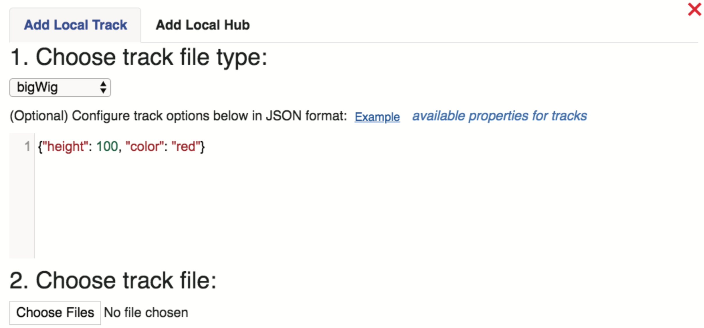

All tracks loaded onto the browser can be easily managed by selecting “Track List”, as demonstrated below.

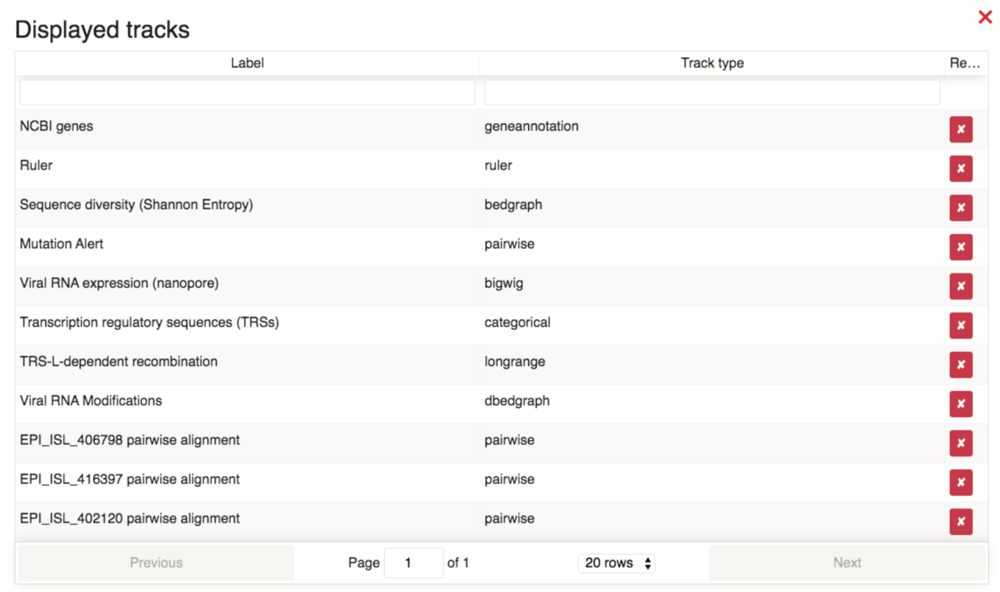

In addition to pre-existing track types hosted on the WashU Epigenome Browser, the WashU Virus Browser also introduces the user to a new additional track type, called a “SNV” track, which displays alignment results in “pairwise” format. The SNV track type displays any genomic variations the strain has from the chosen reference (3 such tracks are pictured below). If the variant is a mismatch, the track will display the deviated nucleotide following the same color scheme as the reference. If a user selects a particular sequence variation, a pop-up window will show the details of the variation. A very detailed description and tutorial regarding the SNV tracks are in the section “SNV Track” below.

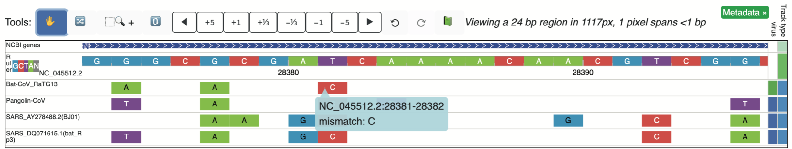

In addition to annotation tracks and user-uploaded tracks, our browser hosts genomics data of various types organized according to studies, pre-prints, or data providers, in a effort to rapidly integrate data. Detailed information pertaining to navigating existing data hubs is provided in the section “Public Data Hubs” below.

Apps
^^^^

All applications available on the WashU Virus Genome Browser are also available on the WashU Epigenome Browser, and are described in detail in the Epigenome Browser tutorial (https://eg.readthedocs.io/en/latest/usage.html#apps). Of the available apps, “Region Set View” allows the user to visualize several distant genomic regions in the same viewing window. Selection “Session” allows the user to save their current browser status, generating a session ID that can be shared with collaborators and allowing for easily resuming gat a later time. “Fetch Sequence” allows the user to quickly obtain the reference sequence spanning the current view in a fasta format. Selecting “Screenshot” allows the user to generate publication-quality SVGs or PDFs of the current frame of view, with the option to highlight genomic regions of interest. Additional apps include “Gene Plot”, “Scatter Plot”, and “Go Live”, which are explained in detail in the Epigenome Browser tutorial.

Settings
^^^^^^^^

Several browser settings have customizable options which the user may define. When selecting the “Settings” drop-down menu, several functions are provided as shown below (and as described in the Epigenome Browser tutorial: (https://eg.readthedocs.io/en/latest/usage.html#settings))

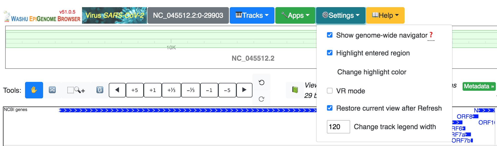

The first option “Show genome-wide navigator” is a toggle option, allowing the user to hid or show the complete genome layout at the top of the browser (circled in red below), highlighting in green the section fo the genome currently being viewed in the browser.

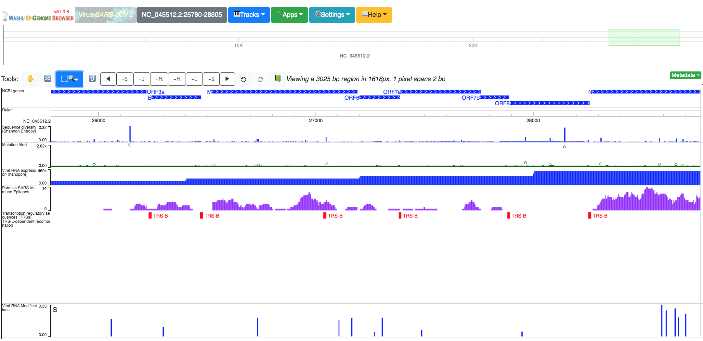

Help
^^^^

The “Help” drop-down menu provides several links to browser resources:

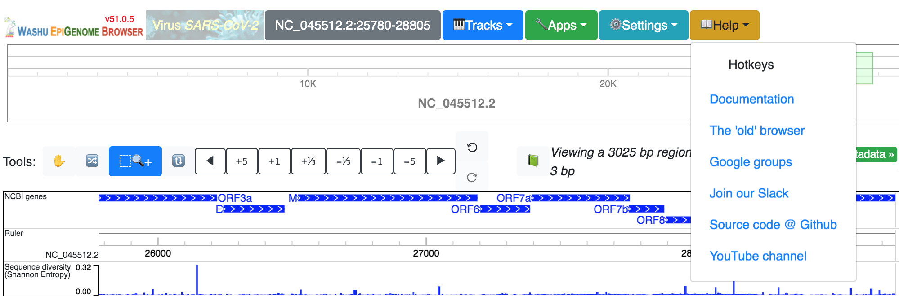

These resources include a list of keyboard shortcuts for commonly used tools:

.. image:: _static/use14.png

Additional links include one to our documentation page, with helpful tutorials, examples, and suggestions for customizing your browsing experience, a link to the original or ‘old’ Epigenome Browser, a google groups page populated with questions and answers, a link to our Slack page, where users can directly communicate with the WashU Virus Genome Browser team in real time, a link to our Github page, which houses our repository of all available scripts, and a link to our YouTube channel, where walk-through clips can be viewed.

Phylogenetic Tree View
----------------------

When users select the “Tree View” (blue arrow in first figure shown above), they are taken to our tree visual representation of the strains from the selected reference species. If the selected reference is SARS-CoV-2, the browser will load in a phylogenetic tree parsed from Nextstrain (http://data.Nextstrain.org/ncov.json), and therefore includes only strains available from Nextstrain. If the user selects any of the remaining three viruses (SARS, MERS, or Ebola), they are directed to an approximately-maximun-likelihood tree consisting of all available strains hosted by NCBI (https://www.ncbi.nlm.nih.gov/nuccore), built using FastTree with the GTR substitution model. 

Coloring Tree by Metadata
^^^^^^^^^^^^^^^^^^^^^^^^^

In any of the four trees available, the user is able to organize the tree by color by selecting either “Clade” (as is the default):

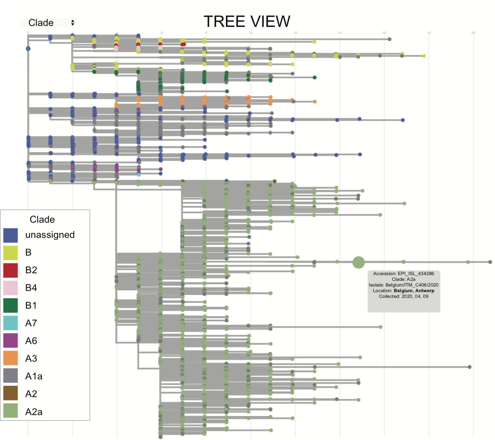

By “Location”:

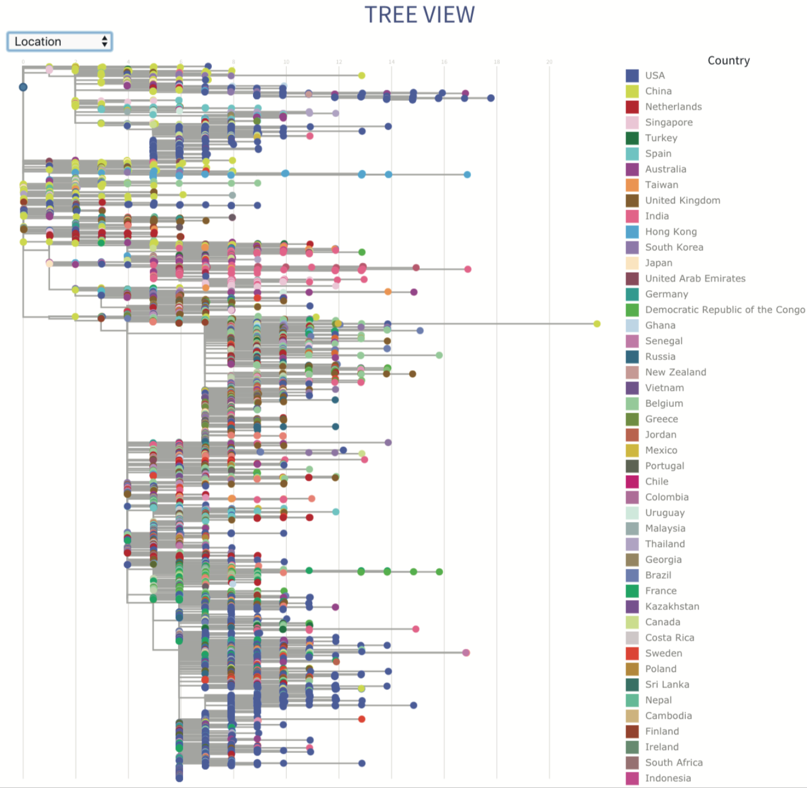

Or by “Collection Date”:

..image:: _static/use17.png

Identifying Strains of Interest
^^^^^^^^^^^^^^^^^^^^^^^^^^^^^^^

If users pre-select strains and add them to their cart from the data table, they can see where their strains of interest fall within the tree. As an example below, the following tracks have been added to cart:

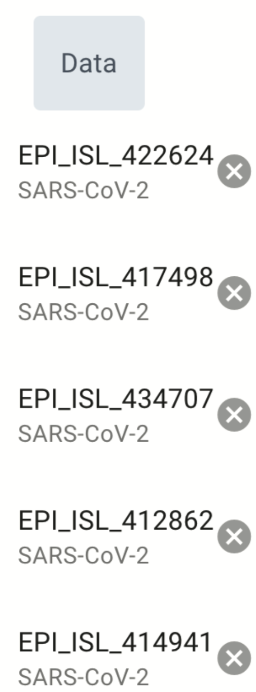

Upon loading in the tree view, all selected strains are enlarged and colored black, as shown below.

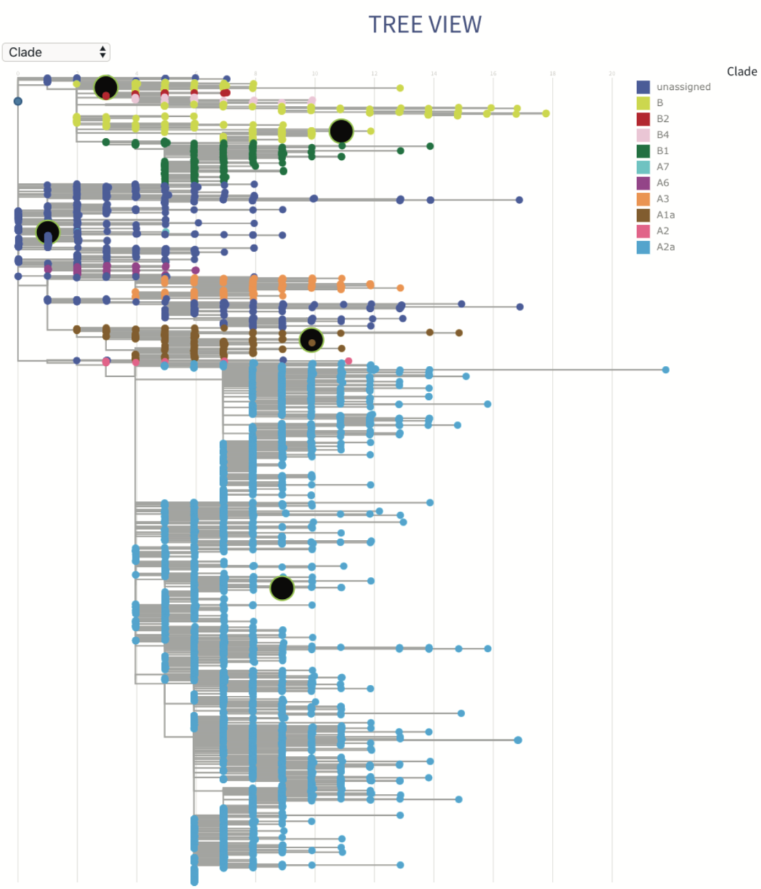
