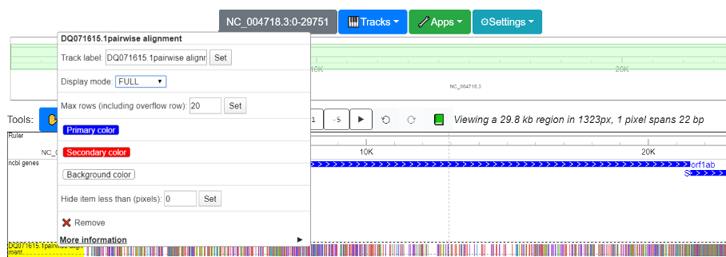
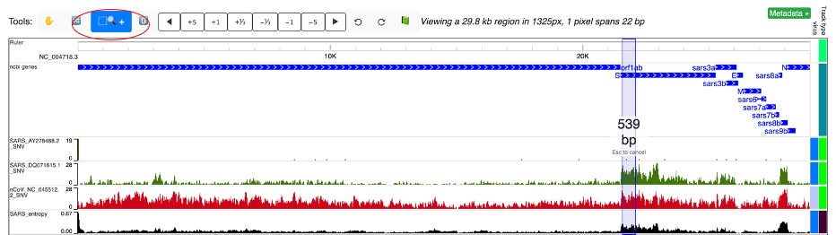
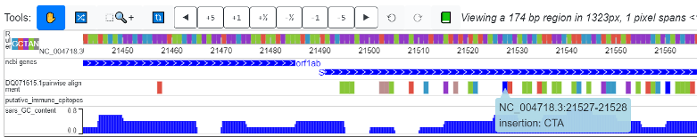
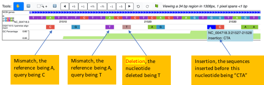
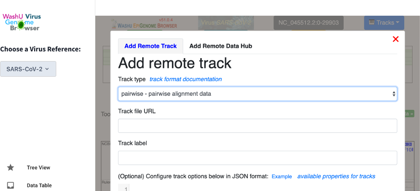
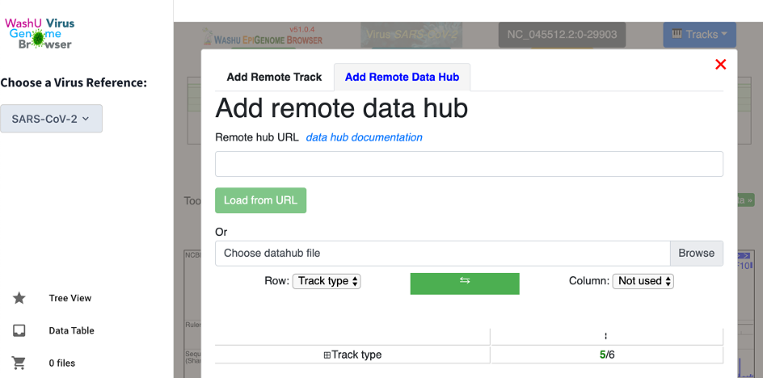

SNV track
=========

This section shows you how to display variations with using “SNV” tracks.

Understanding the SNV track
---------------------------

The SNV track is a new track type added to the WashU Virus Genome Browser to view sequence variations from the reference. The track supports 2 display modes: “density” mode for a “zoomed out” view and “full” mode for a “zoomed in” view. The “density” mode displays the density of variation, suitable for a genomic view, whereas the “full” mode has a color code for the detailed information of each variation, suitable for viewing an individual locus. To switch between density mode and full mode, right click on the head of the track and use the “display mode” drop-down menu. 

Density mode and the “zoomed-out” view
--------------------------------------

The density mode was implemented because when viewing the entire genome, individual variations are impossible to see. Instead, the density mode depicts the frequency of mutations across the genome, averaging over genomic intervals, as illustrated in the screenshot below. 2 SARS strains (AY278488.2 (“BJ01”) and “DQ71615.1 (“bat rp3”)) and one SARS-CoV-2 strain (the reference strain, NC_045512.2) are aligned to the SARS reference genome. Sequence variation displayed in density mode shows that the divergence between the SARS-CoV-2 reference genome (red, below) and the SARS reference genome is higher than the divergence between the two additional SARS strains (green, below) and the SARS reference genome. 

For AY278488.2, the variation from reference is mainly confined to the beginning of the genome, while the remainder of the genome is relatively consistent with the reference. However, for DQ071615.1 (bat-derived), the 5’ end of gene S displays high variation from the reference genome. Likewise, the SARS Shannon track shows that the SARS genome is highly diverse across different strains across gene S. Once a region of interest is identified, the standard magnification tool (circled in red) of the browser can be used to quickly zoom into the region.

Full mode at a zoomed in view
-----------------------------

When zoomed in to the nucleotide-level and displayed in “Full” mode, a color-coded track indicating all the variation from reference will be shown. The “Full” mode is further detailed below.

Nomenclature:
^^^^^^^^^^^^^

**Reference**: the “reference” is the sequence corresponding to the viral species selected by the user. It is the one completely color coded according to nucleotides and is shown as the “ruler” at the top of the browser view. The references hosted on the browser for the 4 virus species (SARS-CoV-2, SARS, MERS, and Ebola) are NCBI reference sequences.

**Query**: The “query” is the sequence being aligned to the “reference”. 

**Variation** refers to events where the nucleotide of the query at a certain position is difference from the reference. It can be a mismatch, insertion or deletion. 

Color code:
^^^^^^^^^^^

Mismatches:

1.	A mismatch from the reference observed at a specific nucleotide, the query being “A”: green (#89C738)
2.	the query being “T”: purple (#9238C7)
3.	the query being “C”: orange (#E05144)
4.	the query being “G”: light blue (#3899C7)
5.	the query being “N”: grey52 (#858585)

Deletions:

1.	If a deletion is present in the query (a gap for the query in the pairwise alignment), the nucleotide will be colored “Rosy brown (#BC8F8F)”

Insertions:

1.	the reference on the browser is always ungapped. If a insertion into the query happens (which signifies a gap for the reference in a pairwise alignment), the nucleotide proceding the insertion will be colored “blue”. Details of inserted sequences will be revealed if you click on the nucleotide colored blue.  

Behind the SNV track: the “pairwise” format
-----------------------------------------

Alignment results can differ significantly when different aligners and different parameters are used. However, most aligners return alignments in the same format: FASTA (or markx3 in the case of EMBL aligners). Therefore, the WashU Virus Genome Browser offers scripts for the user to convert their own alignment results into “pairwise”-formatted files, which can be directly uploaded and displayed on the browser. Scripts can be found on our GitHub page: https://github.com/debugpoint136/WashU-Virus-Genome-Browser.

Uploading interface
^^^^^^^^^^^^^^^^^^^

In the browser view, click “Tracks” and then “Remote Tracks”. This will lead the user to a upload interface. Once there, select “pairwise” as the track type and enter the track’s URL.

Alternatively, if the track is stored on the user’s local computer, he/she can upload the track by selecting “Tracks” > “Local Tracks”. See the “Tracks” section under “Navigating the WashU Virus Genome Browser” above for more details.

The pairwise format
^^^^^^^^^^^^^^^^^^^

The pairwise format is an extension of the .bed format, where the 4th column contains variations from the reference. Specifically::

Column 1: Name of the reference that the query is aligned to
Column 2: The start position on the reference
Column 3: The end position on the reference
Column 4: Variation type and details

For columns 2 and 3, since the pairwise format is per-nucleotide, “end” usually equals “start” + 1 (the only exception is a deletion, and when several consecutive nucleotides are deleted, they can be merged into 1 line). Also, the browser is 0-based, which means that if there is a mismatch at the first nucleotide, column 2 would be “0” while column 3 would be “1”.

For column 4, the format is “variation_type:detail”. Variation types are: “insertion”, “deletion”, and “mismatch”. For “insertion”, “detail” is the sequence inserted before this nucleotide. For “deletion”, the “detail” is the nucleotide of the reference at this position that was deleted. For “mismatch”, “detail” is the nucleotide of the query.

.. note:: Matches between the query and the reference are not coded in the pairwise format. 

.. code-block:: bash

    NC_004718.3     96      97      mismatch: T
    NC_004718.3     140     141     mismatch: C
    NC_004718.3     142     143     mismatch: G
    NC_004718.3     258     260     mismatch: A

    NC_004718.3     3089    3090    insertion: GG
    NC_004718.3     3093    3094    insertion: CTCA
    NC_004718.3     21527   21528   insertion: CTA
    NC_004718.3     21560   21561   insertion: C

    NC_004718.3     3059    3062    deletion: AGA
    NC_004718.3     3223    3224    deletion: A

.. note:: The files need to sorted, zipped and indexed before uploading, just as any .bed file would need to be. To zip the files:

.. code-block:: bash
    sort -k1,1 -k2,2n snvfile > snvfile.sort
    bgzip snvfile.sort
    tabix -p bed snvfile.sort.gz

To generate the pairwise format
^^^^^^^^^^^^^^^^^^^^^^^^^^^^^^^

We offer a script (“publicConvertMarkx3.py) to generate a pairwise-formatted file from any pairwise alignment result in markx3 or FASTA format. The requirements are as follows:

1.	The reference should be the first sequence.
2.	Only 2 sequences should be present in the file (as is the case for pairwise alignment).

An example FASTA-formatted pairwise alignment result is shown below::

    >test_reference ..
    ATGAGTCTCTCTGATAAGGACAAGGCTGCTGTGAAAGCCCTATGG------A
    >test_query ..
    CTG--TCTC-CTG---CCGACAAGACCAACGTCAAGGCCGCCTGGGGTAAGA

The script used to convert this to our pairwise format is: “publicConvertMarkx3.py”, which calls “convert_tsv_to_bed_and_cat.sh” (both located on our GitHub page: https://github.com/debugpoint136/WashU-Virus-Genome-Browser). 
To see help, use: 

.. code-block:: bash

    $ python publicConvertMarkx3.py
    usage: python publicConvertMarkx3.py <markx3> <out_pairwise> <script_dir>

    [Required]
            <markx3>					pairwise alignment output in markx3 format. the first sequence should be the reference
                                                
                                                
            <out_pairwise>			output pairwise formatted file that can be displayed directly on wash u virus browser as SNV track
            
            <script_dir>				the directory where all our scripts are stored
            
    contact: changxu.fan@gmail.com for help

The output files will be automatically zipped and ready to go!! 

Batch alignment from FASTA to pairwise format
^^^^^^^^^^^^^^^^^^^^^^^^^^^^^^^^^^^^^^^^^^^^^

We offer another script (“publiAlignment.py”) that can perform pairwise alignments in batch (using EMBL aligners “stretcher” or “water”) and directly generate files in pairwise format that can be directly uploaded as SNV tracks.

The script is: publicAlignment.py and is located here: https://github.com/debugpoint136/WashU-Virus-Genome-Browser/blob/master/scripts/publicAlignment.py

.. code-block:: bash

    $ python publicAlignment.py 
    Batch pairwise sequence alignment using "stretcher" or "water". 
    outputs "pairwise" format files that can be directly displayed on the wash u viral browser as SNV tracks.

    [Required (for job submission)]
            --script_dir			the directory where all our scripts are stored
            --ref_fa				fasta file containing reference sequence. All other sequences will be aligned to it. Should contain only one sequence
            --strain_fa				fasta file containing sequences of individual strains. Can contain multiple sequences. They will be aligned to ref_fa in a pair-wise manner separately
            --tempt_dir				tempt_dir to store intermediate files
            --SNV_dir				the directory to store generated pairwise files
            --aligner				aligner to use. currently support "stretcher" for global alignment and "water" for local alignment
            --email 				required by the embo aligners. you will not receive junk from them
    contact: changxu.fan@gmail.com for help

Batch upload as json files
^^^^^^^^^^^^^^^^^^^^^^^^^^

We offer another script (“publicJsonGen.py”, located here: https://github.com/debugpoint136/WashU-Virus-Genome-Browser/blob/master/scripts/publicJsonGen.py)that takes in a tab-delimited txt file (.tsv file) listing the web location and track type of individual files, and output a .json file that can be used to upload multiple tracks in batch.

.. code-block:: bash

    $ python publicJsonGen.py 
    usage: python publicJsonGen.py <tsv> <json>

    [Required]
            <tsv>				a tsv file with 4 columns: name, url, track_type, virus. one line per track
                                                the file should contain header. 
                                                order of the columns doesn't matter.
                                                virus means virus type, used for metadata.
            <json>				output json file that can be directly uploaded onto wash u virus browser as custom datahub
            
    contact: changxu.fan@gmail.com for help

The .tsv file that can be converted looks like this:

.. csv-table::
    :header: "name", "url",	"track_type", "virus"

    "SARS_AY278488.2_SNV", "https://your.url.to.file1", "pairwise",	"SARS"
    "SARS_DQ071615.1_SNV", "https://your.url.to.file2", "pairwise", "SARS"
    "SARS_AY278488.2_SNV", "https://your.url.to.file3", "pairwise", "SARS"

Upload json-formatted datahub
^^^^^^^^^^^^^^^^^^^^^^^^^^^^^^^^

To upload a json-formatted data hub, in the browser view, select “Tracks” and then select either “Remote Tracks” or “Local Tracks” (depending on whether the .json file is stored remotely to locally, see above documentation under “Navigating the WashU Virus Genome Browser” for further details.

A .tsv file should have a format similar to that shown below in order for a successful conversion.

name	url	track_type	virus
SARS_AY278488.2_SNV	https://your.url.to.file1	pairwise	SARS
SARS_DQ071615.1_SNV	https://your.url.to.file2	pairwise	SARS
SARS_AY278488.2_SNV	https://your.url.to.file3	pairwise	SARS
