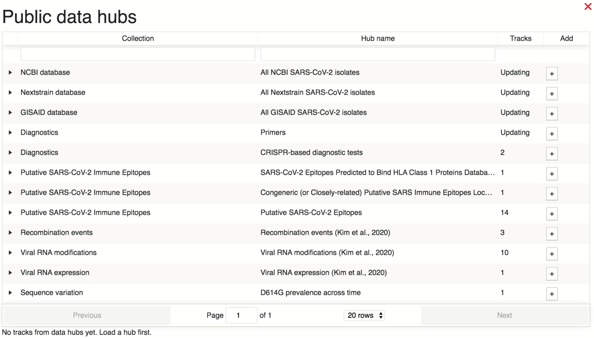
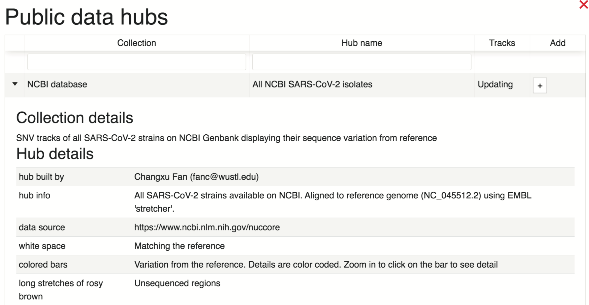
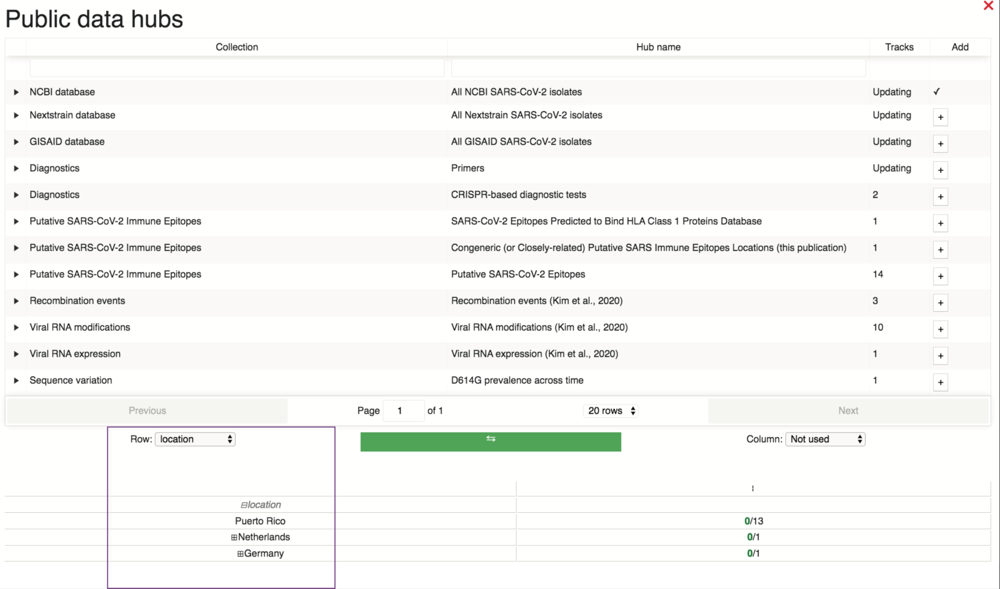
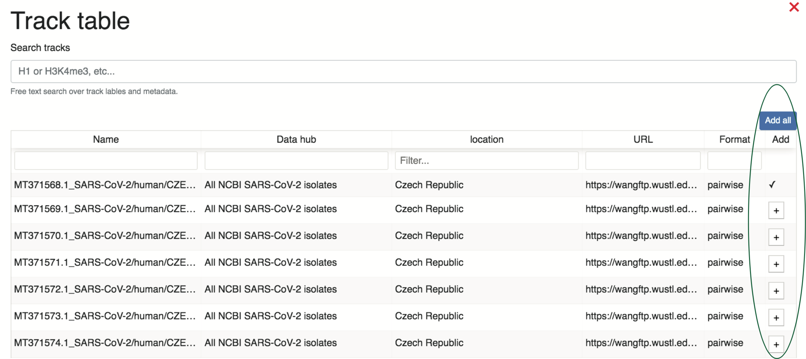
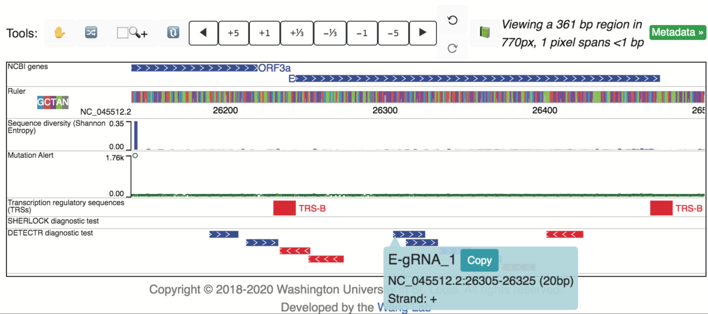
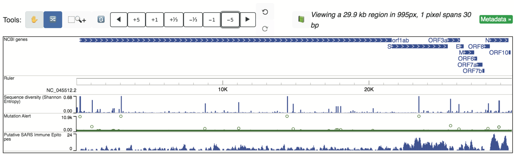
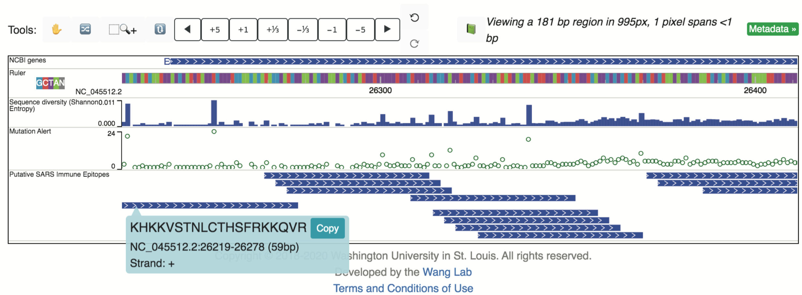
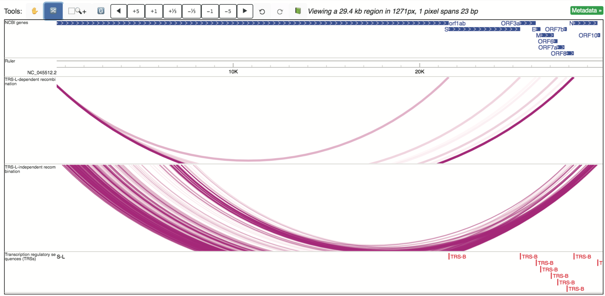

Public Data Hubs
================

As individual research groups continue to rapidly study SARS-CoV-2, there has been a surge in available SARS-CoV-2 genomics data, ranging from though sands of sequenced strains, to host immune responses, and viral expression and modifications. As this data is becoming available, we are integrating relevant findings onto our browser in the form of public data hubs for efficient upload of several related tracks for easy visual comparisons. Here, we will introduce how to load a specific data hub of interest and also briefly introduce all existing public data hubs (as of May 24, 2020). Please not that we will continue to update this documentation	as additional public data hubs are added.

Loading in a public data hub
----------------------------

From the main browser view, information regarding existing data hubs can be viewed by selecting “Tracks” > “Public Data Hubs”. This will populate a table with information regarding data hub collection names, hub names, and numbers of tracks.

Users can get more information regarding a data bub of interest, such as the data source and track descriptions, by selecting the collection, as demonstrated below.

To load tracks from a given data hub onto the browser, the user can select the “+” button under the “Add” column. This will populate a sortable metadata table where the user can select specifically which tracks to add from the data hub. In the example below, data are being sorted by location, as highlighted in the purple box (although, please not that the majority of the locations are not pictured here, but are available on the browser).

After selecting a metadata term of interest, such as :Czech Republic” above, the user can add the tracks to their browser view by selecting the “+” to the right of the track(s), as shown in green below.

Data tracks from all existing data hubs or user-uploaded tracks can be managed in a similar way by selecting “Tracks” and then “Track Facet Table”.

Introducing currently available public data hubs (As of May 24, 2020)
---------------------------------------------------------------------

Here, we introduce all available public data hubs as of May 24, 2020, organized by Collection. Please note that this selection will continue to expand as new studies are made available regarding SARS-CoV-2 and related host genomic data.

NCBI database
^^^^^^^^^^^^^

As of May 24, 2020, 3896 SARS-CoV-2 sequences are available from NCBI (https://www.ncbi.nlm.nih.gov/nuccore). Pairwise alignments between all available strains and the reference have been added to the NCBI database public data hub and are available for viewing on the WashU Virus Genome Browser in the form of SNV tracks (detailed above in the “SNV” section). All strains can be added to the browser at once, or the user can sort the strains by location and collection date to pre-filter for specific strains of interest. Similarly, metadata information regarding location and collection date can be displayed on the right side of the tracks once loaded into the browser view, by selecting “Metadata” and specific terms of interest, as shown below.

.. image:: ?static/hub5.png

Nextstrain database
^^^^^^^^^^^^^^^^^^^

As of May 24, 2020, 4415 SARS-CoV-2 sequences are available from Nextstrain (https://data.Nextstrain.org/ncov.json). Pairwise alignments of all available strains to the reference have been added to the Nextstrain database public data hub and are available for viewing on the browser in the form of SNV tracks (detailed above in the “SNV” section). As described above, all strains can be added to the browser at once, or a subset can be selected for upload bu pre-filtering the strains by specific metadata terms of interest.

GISAID database
^^^^^^^^^^^^^^^

As of May 24, 2020, 30612 SARS-CoV-2 sequences are available from GISAID. Pairwise alignments between all available strains and the reference sequence have been added to the GISAID database public data hub and are available for viewing on the browser in the form of SNV tracks (detailed above in the “SNV” section). As described above, all strains can be added to the browser at once (no recommended, as there are several thousand), or a subset can be selected for upload by pre-filtering the strains by specific metadata terms of interest.

Diagnostics
^^^^^^^^^^^

The Diagnostics Collection currently houses two separate data hubs, both of which are described below. All data hubs encompassed in this collection contain relevant annotations pertaining to diagnostic testing.

**Primers**

As of May 24, 2020, the locations of primers for SARS-CoV-2 testing have been made available for the USA (3 sets of CEC primers), China, Hong Kong, France, Germany, Japan, and Thailand. All primer sequence locations are made available in the Primers database public data hub, and can be loaded in all at once or based on country of interest. 

**CRISPR-based diagnostic tests**

The CRISPR-based diagnostic tests data hub consists of two tracks: a SHERLOCK diagnostic test track displaying primer and guide RNA sequence locations used in the CRISPR-Cas13a-based SHERLOCK assay for detecting SARS-CoV-2 (https://www.braodinstitute.org/files/publications/special/COVID-19%20detection%20(updated).pdf), and a DETECTR diagnostic test track displaying the primary and guide RNA sequence locations used in the CRISPR-Cas12-based DETECTR assay for detecting SARS-CoV-2 (PMID: 32300245). An example highlighting the location of a DETECTR E guide-RNA is shown below, revealing low sequence diversity at this location.

Putative SARS-CoV-2 Immune Epitopes
^^^^^^^^^^^^^^^^^^^^^^^^^^^^^^^^^^^

The collection “Putative SARS-CoV-2 Immune Epitopes” currently consists of three data hubs: “SARS-CoV-2 Epitopes Predicted to Bind HLA Class 1 Proteins”, “Congeneric (or Closely-related) Putative SARS Immune Epitopes”, and “Putative SARS-CoV-2 Epitopes”. All three data hubs feature the locations of immune epitopes, some of which were identified in SARS-CoV-2 and maintain sequence conservation in SARS-CoV-2.

**SARS-CoV-2 Epitopes Predicted to Bind HLA Class 1 Proteins**

Predicted SARS-CoV-2 epitopes likely to bind class 1 MHC proteins were made available in the pre-print Campbell, et al., 2020 (DOI: 10.1101/2020.03.30.016931). Locations of the predicted sequences within the SARS-CoV-2 genome were identified (those with 100% sequence similarity and on the positive strand) and their locations (x-axis) as well as the number of unique strain IDs reporting the peptide (y-axis) are shown when loading in the track “Antigenic_peptide_predictions”, as shown below.

.. image:: _static/hub7.png

**Congeneric (or Closely-related) Putative SARS Immune Epitopes**

Linear immune epitopes identified in SARS-CoV-2 cataloged in the Immune Epitope Database and Analysis Resource (IEDB) that retain 100% sequence identity in SARS-CoV-2 are displayed in a single track, which can be set to either “Density” mode to view the abundance of epitopes over large portion of the genome:

Or can be set to “Full” mode to visualize individual epitopes, whose sequences are displayed upon selection:

**Putative SARS-CoV-2 Epitopes**

This data hub hosts several (14) different tracks, pertaining to an assortment of different studies, and includes tracks displaying CD8 epitopes restricted to HLA*02:01 (DOI: 10.1101/2020.03.23.004176), B cell immune epitope predictions (DOI: 10.1101/2020.02.12.946087), CD4 T-cell immune epitope predictions (DOI: 10.1101/2020.02.12.946087), CD8 T-cell immune epitope predictions (DOI: 10.1101/2020.02.12.946087), putative epitopes for CD8+ T cells with widespread HLA binding properties (DOI: 10.1101/2020.04.06.027805), and N-terminal SARS-CoV-2 putative MHC-II epitopes (DOI: 10.1101/2020.04.17.20061440).

Recombination Events
^^^^^^^^^^^^^^^^^^^^

Recombination events in the SARS-CoV-2 transcriptome were detected by junction-spanning RNA-seq reads generated by Kim, et al., 2020 (PMID: 32330414), and comprise three tracks collectively making up the Recombination events data hub. Of the three included tracks, two are longrange interaction tracks, displaying TRS-L dependent recombination events and TRS-L-independent recombination events, respectively. Locations of predicted recombination sites (TRSs or transcription regulatory sequences) are also available as an additional track. All three are shown below.

Viral RNA modifications
^^^^^^^^^^^^^^^^^^^^^^^

RNA modifications detected using Nanopore direct sequencing are reported in Kim et al., 2020 (PMID: 32330414), and comprise the 11 tracks available in the Viral RNA modifications data hub. Modification states include: gRNA, S, 3a, E, M, 6, 7a, 7b, 8, and N. Each modification has a static track that can be loaded in individually. In addition, a dynamic track is available (and also loaded in the default SARS-CoV-2 browser view) which rotates through displaying the modification signal across the genome for each modification. 

.. image: _static/hub11.png

Viral RNA expression
^^^^^^^^^^^^^^^^^^^^

Nanopore expression data was collected for SARS-CoV-2-infected Vero cells, and reported in Kim et al., 2020 (PMID: 32330414). In our data hub “Viral RNA expression”, we have added a bigwig file which displays the raw nanoproe read counts at each genomic position. This track, shown below, is also one of the tracks displayed by default for SARS-CoV-2.

.. image: _static/hub12.png

SARS-CoV-2 host transcriptional responses database
^^^^^^^^^^^^^^^^^^^^^^^^^^^^^^^^^^^^^^^^^^^^^^^^^^

In addition to viral genomics pairwise alignments hosted by the browser, the WashU Virus Browser offers a unique view of host transcriptional responses to SDARS-CoV-2 infection through partnership with the WashU Epigenome Browser. When navigating to the WashU Virus Genome Browser landing page, the user can opt to view data hubs containing host repossess by selecting the link “Host transcriptional responses to SARS-CoV-2” under the “Featured Datahubs” drop-down menu. Selecting this link redirects the user to the hg38 genome hosted in the WashU Epigenome Browser, as shown below.

.. image: _static/hub13.png

As demonstrated above, 12 RNA-seq tracks are pre-loaded into view from the pre-print Blanco-Melo, et al., 2020 (PMID: 32416070). However, the user can choose to look at additional tracks available within the data hub by selecting “Tracks” > “Public Data Hubs” > “SARS-CoV-2 Host Transcriptional Responses (Blanco-Melo, et al. 2020) Data Hub.” The data hub houses 195 RNA-seq tracks which can be either directly loaded into view, or can be pre-filtered based on several metadata terms. Once desired tracks are loaded into view, associated metadata can be displayed and includes the options shown below.

.. image: _static/hub14.png
